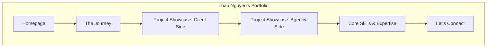
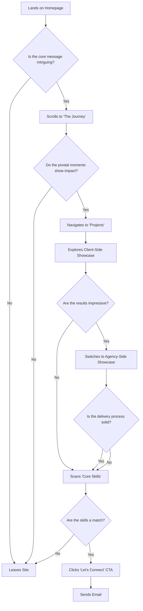

# Thao Nguyen Creative Marketer Portfolio UI/UX Specification

## 1. Introduction

This document defines the user experience goals, information architecture, user flows, and visual design specifications for the **Thao Nguyen Creative Marketer Portfolio**'s user interface. It serves as the foundation for visual design and frontend development, ensuring a cohesive and user-centered experience.

### 1.1 Overall UX Goals & Principles

#### Target User Personas
*   **The Hiring Manager (Primary):** A senior Marketing or Brand Manager. They are busy, results-oriented, and time-poor. They need to quickly assess a candidate's strategic thinking, past performance, and professional polish. They are skeptical of fluff and value concrete, quantifiable results.
*   **The Recruiter/Sourcer (Secondary):** A talent acquisition professional. They are less focused on the deep strategy and more on keyword matching for skills and experience. They need a scannable, clearly organized site to quickly determine if the candidate is a potential fit.

#### Usability Goals
*   **Memorability:** The site's unique structure and narrative should leave a lasting, positive impression.
*   **Efficiency of Use:** The primary persona should be able to grasp the candidate's core value proposition and see their best work in under 60 seconds.
*   **Clarity:** The connection between claims (e.g., "Campaigns that Perform") and proof (the project showcases) must be direct and unambiguous.

#### Design Principles
1.  **Narrative First:** Every design choice must serve the central story of a dual-expertise marketer.
2.  **Clarity Through Structure:** Use a strong, predictable visual hierarchy to make the site easy to scan and digest.
3.  **Delight in the Details:** Use subtle animations and micro-interactions to create a polished, premium feel without sacrificing performance.
4.  **Proof over Platitudes:** Every statement of skill or value must be backed by tangible evidence in the project showcases.

---

## 2. Information Architecture (IA)

This section defines the structure of the single-page experience, ensuring a logical and intuitive flow for the user.

### 2.1 Site Map / Screen Inventory

Since this is a single-page application, the "site map" represents the distinct sections a user will scroll through.

### 2.2 Navigation Structure

*   **Primary Navigation:** A fixed (or "sticky") navigation bar at the top of the page is recommended. It should be subtle and minimalist, containing anchor links that smoothly scroll the user to the corresponding section.
    *   *Elements:* Journey | Projects | Skills | Contact
*   **Secondary Navigation:** Within the "Projects" section, the user will encounter tab-based navigation to switch between the Client-Side and Agency-Side showcases.
*   **Breadcrumb Strategy:** Not applicable for a single-page website.

---

## 3. User Flows

This section maps out the intended path a user will take through the site to accomplish a specific goal. For this portfolio, the primary user flow is "Candidate Evaluation."

### 3.1 User Flow: Candidate Evaluation

*   **User Goal:** As a Hiring Manager, I want to quickly determine if this candidate has the strategic vision, creative talent, and proven results to be a good fit for my team.
*   **Entry Points:** Direct link from a resume, LinkedIn profile, or email.
*   **Success Criteria:** The Hiring Manager can clearly articulate Thao's value proposition and has bookmarked the site or initiated contact.

#### Flow Diagram

#### Edge Cases & Error Handling:
*   **Anchor link failure:** If a navigation link fails to scroll, the user can still scroll manually. The linear, single-page layout is a natural fallback.
*   **Slow asset loading:** Project showcase images/videos should use placeholders (like a blurred, low-res version) and lazy loading to ensure the user doesn't see a blank space.
*   **`mailto:` link issues:** If the user doesn't have a default email client configured, the email address should be included as plain text near the button as a fallback.

---

## 4. Wireframes & Mockups

This section provides a low-fidelity blueprint for the layout of each key screen (or section) of the portfolio.

**Primary Design Files:** The high-fidelity mockups and interactive prototypes will be created and maintained in Figma.
*   **Figma Project Link:** `[Link to be added]`

### 4.1 Key Screen Layouts

#### Screen: Homepage
*   **Purpose:** To create immediate intrigue and clearly communicate Thao's unique value proposition.
*   **Key Elements:** Full-screen background, Main Headline (H1), Sub-headline (H2/H3), Interactive Zones, Scroll Affordance.
*   **Interaction Notes:** A subtle hover effect should occur over the interactive zones.

#### Screen: The Journey
*   **Purpose:** To present a curated narrative of career highlights in a scannable and engaging way.
*   **Key Elements (Desktop):** Section Headline (H2), Timeline Navigation, Content Display Area.
*   **Key Elements (Mobile):** Section Headline (H2), Card Carousel, Pagination Dots.
*   **Interaction Notes:** Clicking a timeline dot (desktop) should smoothly fade in content. Swiping (mobile) should have a smooth, inertial feel.

#### Screen: Project Showcase (Client/Agency)
*   **Purpose:** To provide compelling, data-driven proof of Thao's capabilities.
*   **Key Elements:** Section Headline (H2), Navigation Tabs, Main Carousel Container, Impact Text (H1/H2), Campaign Nav, Scope Details.
*   **Interaction Notes:** The carousel must be user-controlled.

---

## 5. Component Library / Design System

**Design System Approach:** A "mini-component library" will be developed specifically for this portfolio.

### 5.1 Core Components
*   **Button:** (Primary CTA, Secondary), with states (Default, Hover, Active, Disabled).
*   **Navigation:** (Sticky Header, Tab Nav, Timeline Nav), with states (Default, Hover, Active).
*   **Story Card:** To display the "Challenge, Action, Result" narrative.
*   **Project Carousel:** To showcase the five key projects for both client and agency sections.

---

## 6. Branding & Style Guide

**Visual Identity:** The aesthetic should be clean, confident, and sophisticated.

### 6.1 Color Palette
| Color Type | Hex Code | Usage |
| :--- | :--- | :--- |
| Primary | `#1A202C` (Charcoal) | Headlines, primary text, dark backgrounds |
| Secondary | `#FFFFFF` (White) | Body text on dark backgrounds, light backgrounds |
| Accent | `#38B2AC` (Teal) | CTAs, links, highlights, active nav states |
| Neutral | `#A0AEC0` (Gray) | Borders, secondary text, disabled states |

### 6.2 Typography
*   **Primary Font Family (Headings):** `Poppins`
*   **Secondary Font Family (Body):** `Inter`

| Element | Size | Weight | Line Height |
| :--- | :--- | :--- | :--- |
| H1 | `48px` | `700 (Bold)` | `1.2` |
| H2 | `36px` | `700 (Bold)` | `1.3` |
| H3 | `24px` | `600 (SemiBold)` | `1.4` |
| Body | `16px` | `400 (Regular)` | `1.6` |

### 6.3 Iconography
*   **Icon Library:** `Feather Icons`
*   **Usage Guidelines:** Use sparingly to support content, always paired with a text label unless universally understood.

### 6.4 Spacing & Layout
*   **Grid System:** A standard 12-column grid.
*   **Spacing Scale:** An 8-point spacing system.

---

## 7. Accessibility Requirements

**Compliance Target:** **WCAG 2.1 Level AA**.

### 7.1 Key Requirements
*   **Visual:** 4.5:1 color contrast, visible focus indicators, text zoom up to 200%.
*   **Interaction:** Full keyboard navigation, semantic HTML for screen readers, 44x44px touch targets.
*   **Content:** Descriptive alt text, logical heading structure, ARIA labels for interactive elements.

### 7.2 Testing Strategy
*   **Automated:** Axe or Lighthouse.
*   **Manual:** Keyboard navigation and screen reader testing.

---

## 8. Responsiveness Strategy

### 8.1 Breakpoints
| Breakpoint | Min Width | Target Devices |
| :--- | :--- | :--- |
| Mobile | `320px` | Most smartphones |
| Tablet | `768px` | iPads, other tablets |
| Desktop | `1024px` | Laptops, smaller desktop monitors |
| Wide | `1440px` | Large desktop monitors |

### 8.2 Adaptation Patterns
*   **Layout:** Single-column on mobile, transitioning to multi-column on larger screens. Max-width on wide screens.
*   **Navigation:** Collapses to a "hamburger" menu on mobile.
*   **Interactions:** Hover-based interactions are replaced with tap-friendly alternatives on mobile.

---

## 9. Animation & Micro-interactions

### 9.1 Motion Principles
*   **Purposeful & Functional**
*   **Smooth & Swift** (200ms-400ms)
*   **Subtle & Sophisticated**

### 9.2 Key Animations
*   **Smooth Scrolling:** For anchor links.
*   **Homepage Hover Effect:** To indicate interactivity.
*   **Section Fade-in on Scroll:** To guide the user's journey.
*   **Timeline Dot Interaction:** For content transitions.
*   **Button & Link Hover:** For standard feedback.

---

## 10. Performance Considerations

### 10.1 Performance Goals (Core Web Vitals)
*   **LCP:** < 2.5 seconds
*   **INP:** < 200 milliseconds
*   **CLS:** < 0.1
*   **Animation FPS:** 60 FPS

### 10.2 Design & Development Strategies
*   Image Optimization (WebP)
*   Lazy Loading for off-screen assets
*   Asset Minification (CSS, JS)
*   Specified dimensions for images/video to avoid layout shift
*   Performant CSS animations
*   Font loading strategy (`font-display: swap;`)

---

## 11. Next Steps

### 11.1 Immediate Actions
1.  **Stakeholder Review:** Approve this document.
2.  **Visual Design Phase:** Begin high-fidelity mockups in Figma.
3.  **Content Finalization:** Write final copy for all sections.
4.  **Asset Gathering:** Collect all images and videos.

### 11.2 Design Handoff Checklist
*   [x] All user flows documented
*   [x] Component inventory complete
*   [x] Accessibility requirements defined
*   [x] Responsive strategy clear
*   [x] Brand guidelines incorporated
*   [x] Performance goals established
